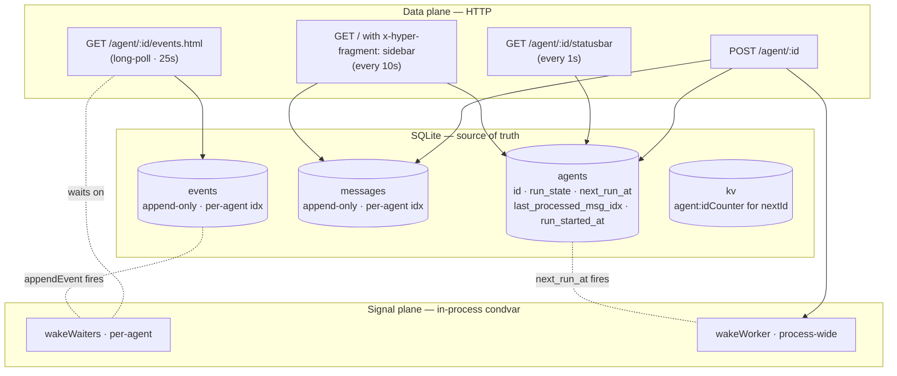
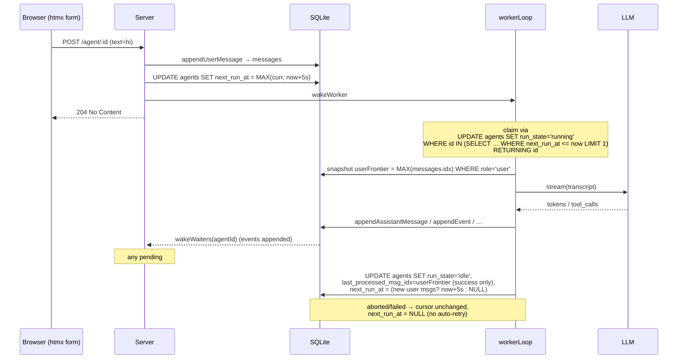
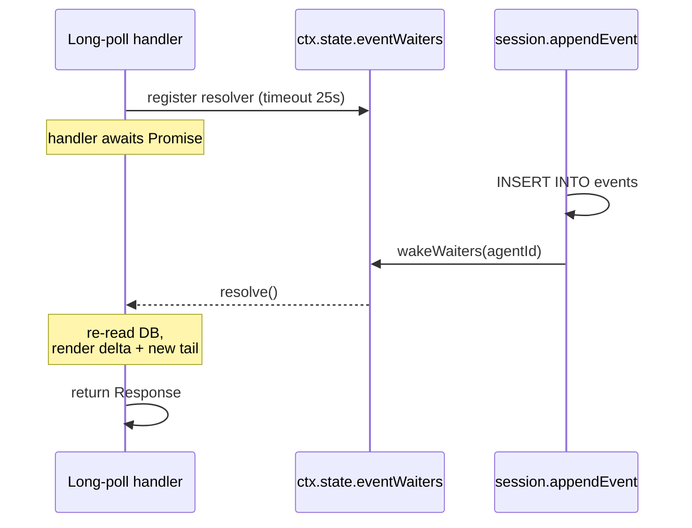

# Architecture

## Direction

**Simplicity first. DB-first. htmx long-poll. One in-process worker, runs in parallel.**

Everything durable lives in SQLite. Everything visible to the user comes from a normal HTTP fetch. There is no queue table — debounce and run-state are columns on `agents`. Realtime is one in-process condvar; it carries no data, only "go look in the DB".



---

## Principles

1. **The DB is the source of truth.** Messages, events, run-state, scheduling — all in SQLite. Memory is only an execution cache.
2. **HTTP is the data plane.** Browser fetches all visible state through normal HTTP requests. Long-polling is just `GET` that holds the connection.
3. **Wakeups are signals, not data.** `wakeWaiters` carries no payload — handlers re-read the DB after they wake. A lost or duplicate wake at worst delays a long-poll until its 25 s timeout, after which it re-fetches anyway.
4. **One worker. No queue table. Parallel drain.** Run scheduling is two columns on `agents`: `next_run_at` (when to fire) and `run_state` (`'idle' | 'running'`). One in-process `workerLoop` claims every currently-eligible agent in a tight `claimOne()` loop and spawns each as its own promise — different agents run concurrently. Per-agent serialisation is enforced by SQLite's `UPDATE … RETURNING` (two concurrent claims can't both win the same `idle` row), not by an in-memory lock.
5. **Minimal client JS.** ~30 lines: Enter-key handler + scroll-on-swap. Everything else is htmx attributes.

---

## Channels at a glance

| Concern              | Channel                                           | Driven by                             |
|----------------------|---------------------------------------------------|---------------------------------------|
| Initial render       | SSR HTML from `GET /agent/:id`                    | server-rendered                       |
| New events appear    | `GET /agent/:id/events.html?offset=N` (long poll) | htmx `#msg-tail` `hx-trigger="load"`  |
| Status & exec time   | `GET /agent/:id/statusbar`                        | htmx `every 1s`                       |
| Sidebar refresh      | `GET <self URL>` with `x-hyper-fragment: sidebar` | htmx `every 10s`                      |
| User submits message | `POST /agent/:id?debounceSeconds=5`               | htmx `hx-post` on the form            |
| Delete a message     | `POST /agent/:id/messages/delete`                 | htmx `hx-confirm` + `hx-post`         |
| Stop / fork / archive| HTML form POST                                    | classic browser submit                |
| REPL UI control      | SSE on `/events`                                  | `events/client.js` (dev convenience)  |

---

## Send flow



POST is **one message INSERT + one agent UPDATE**. No queue row. No payload duplicate of the message text — the message itself is the input.

If two POSTs land within the debounce window, both rows are appended to `messages`, and `next_run_at = MAX(...)` keeps the run scheduled for the latest one. When the worker fires, both messages go to the LLM in one transcript — natural merge.

## Receive flow

The browser opens `GET /agent/:id/events.html?offset=N` (htmx `hx-trigger="load"` on the tail div). The server checks `getMaxEventIdx`. If new events exist → render them + a fresh `<div id="msg-tail">` and return. If not → `await waitForEvent(ctx, id, 25_000, req.signal)`. While waiting, any `appendEvent` for this agent fires `wakeWaiters(agentId)` and the handler resumes, re-reads the DB, and returns the delta.

After the swap, htmx auto-fires the next poll because the new `<div id="msg-tail">` again has `hx-trigger="load"`.

---

## Recovery

| Event                       | What happens                                                                  |
|-----------------------------|-------------------------------------------------------------------------------|
| Browser refresh             | SSR renders all messages; long-poll opens at the new `last idx + 1`.          |
| Lost network                | Long-poll reconnects; comes in with the last cursor; gets the delta.          |
| Server restart              | `loadAll` rehydrates agents; pending `run_state='running'` rows reset on next worker pass (see Remaining work). |
| Wake signal lost            | Long-poll's 25 s timeout falls back to a fresh `getEvents` re-read. Harmless. |

---

## Run-state on the agents row

```sql
agents.next_run_at            INTEGER       -- ms epoch when next run should fire (NULL = nothing scheduled)
agents.last_processed_msg_idx INTEGER       -- cursor over USER messages; advances only on successful run
agents.run_state              TEXT          -- 'idle' | 'running'
agents.run_started_at         INTEGER       -- for status-bar elapsed counter
agents.last_error             TEXT          -- last error text (audit-lite)
```

Rules:

- `POST` does `UPDATE agents SET next_run_at = MAX(COALESCE(next_run_at, 0), now + N)`. The `MAX` prevents an earlier message from rolling back an already-pushed-out run.
- The worker's atomic claim is `UPDATE agents SET run_state='running' WHERE id IN (SELECT id FROM agents WHERE run_state='idle' AND next_run_at <= now ORDER BY next_run_at ASC LIMIT 1) RETURNING id`. SQLite's `RETURNING` makes this one-statement-atomic — two concurrent statements **cannot** both win the same row, so two parallel runners trying to grab the same agent will see exactly one `claimed.length === 1` and one `claimed.length === 0`.
- **Cursor scope is `role='user'` AND `excluded_from_cursor=0`.** Both the pre-run frontier snapshot and the post-run "still pending" check filter out synthetic `§result:*` / `§error:*` user-rows. Assistant emissions are not `role='user'` to begin with. Without this, every successful turn would look like fresh input and the worker would re-run on the same conversation forever.
- `last_processed_msg_idx` only advances on **success**. Aborted or failed runs leave the cursor where it was. They also do **not** auto-reschedule (`next_run_at = NULL` on the failure path) — the user's next POST decides whether to retry. Otherwise a permanently broken LLM call would burn the worker in a tight loop.
- If new **real user** messages land while a run is in progress, the worker's `finally` block detects `MAX(idx) WHERE role='user' AND excluded_from_cursor=0 > cursor` and sets `next_run_at = now + 5s` again before returning to `idle`. Successful run → auto-rescheduling for the new input. Failed run → no rescheduling.

### Concurrent drain

`workerLoop` is one promise but it spawns N concurrent `runOne` promises:

```ts
while (workerLoopRunning) {
    let drained = 0;
    while (true) {
        const id = claimOne(ctx, Date.now());
        if (!id) break;
        drained++;
        const p = runOne(ctx, id).finally(() => inflight.delete(p));
        inflight.add(p);
    }
    if (inflight.size === 0)      await waitForWork(ctx, untilNextRunAt);
    else if (drained === 0)       await waitForWork(ctx, MAX_IDLE_MS);
    // else: keep draining until claimOne returns null
}
```

No artificial concurrency cap — backpressure comes from the LLM provider (429s, connection errors, retried in `streamCodex` / `streamAnthropic`) and SQLite serialising writes at microsecond scale. `runOne`'s `finally` calls `wakeWorker` so a finishing run unblocks the loop without waiting for the 30 s safety poll. Verified by `src/agent/workerLoop.test.ts` — three mock runs of 100 ms each land in ~150 ms wall-clock with overlapping intervals; serial would be ~300 ms with none.

---

## Long-poll wake mechanism

It's an in-process condition variable: `Map<agentId, Set<resolver>>` on `ctx.state.eventWaiters`. Not SSE, not a socket — just promises in heap.



### Properties

| Property              | How                                                                                      |
|-----------------------|------------------------------------------------------------------------------------------|
| Per-agent isolation   | `Map` key is `agentId`. Waking one agent doesn't touch others.                           |
| Multiple subscribers  | `Set<resolver>` — many tabs / devices on the same agent wake together.                   |
| Idempotent wakes      | `wakeWaiters` on empty set is no-op. Duplicate wakes are harmless.                       |
| Auto-cleanup          | Resolver is removed in all three terminal paths (wake, timeout, abort).                  |
| Disconnected client   | `req.signal` aborts → `onAbort` removes the resolver. Bun drops the response silently.   |
| Liveness              | `appendEvent` is on the critical path of every event write — no "forgot to notify" bug.  |

The wake carries **zero payload**. It's a hint: "something changed, re-read the DB if you care." Correctness lives in the post-wake DB read, not the signal.

### Worker uses the same pattern

`wakeWorker` + `workerLoop`'s `waitForWork` use a process-wide `Set<() => void>` at `ctx.state.workerWakeWaiters`. POST calls `wakeWorker` after bumping `next_run_at`. `runOne`'s `finally` also calls `wakeWorker` — so when one of the parallel runs finishes, the loop notices straight away and tries another claim. The waiter is process-wide because there's only one driver promise; the parallelism happens inside it via `inflight` Set.

So the system has exactly **two condvars**:
- `eventWaiters` (per-agent) — wakes long-poll handlers.
- `workerWakeWaiters` (process-wide) — wakes the worker driver loop, which then drains every claimable agent in parallel.

### Bun.serve idleTimeout caveat

`Bun.serve` defaults to 10 s `idleTimeout`. A long-poll handler that's awaiting and writing nothing **is** "idle" by Bun's definition — at 10 s the socket is silently closed mid-response (server-side log records 200, curl gets exit 52 "got nothing").

Per-request fix: `server.timeout(req, 30)` from inside the handler. `src/agent/$route_$id_events.html_GET.ts` calls `ctx.state.server.server.timeout(req, ~30)` once it accepts the request, leaving the global default at 10 s for normal endpoints. Reference: [Bun docs — Server.timeout](https://bun.com/reference/bun/Server/timeout) and [oven-sh/bun#13712](https://github.com/oven-sh/bun/issues/13712).

---

## Offsets and cursors

`events.idx` and `messages.idx` are per-agent monotonic integers, assigned by `appendEvent` / `appendMessage` as `MAX(idx) + 1`. The browser tracks one cursor per page, derived from the URL of the most recent `#msg-tail`:

```html
<div id="msg-tail"
     hx-get="/agent/:id/events.html?offset=N"
     hx-trigger="load"
     hx-swap="outerHTML">
</div>
```

The server response contains the new events HTML followed by a fresh `#msg-tail` with `offset = nextIdx`. After the swap, htmx auto-fires the next request because the new tail also has `hx-trigger="load"`.

`session.getMaxEventIdx(ctx, agentId)` returns the cursor head; `session.getEvents(ctx, agentId, { fromIdx, limit })` returns the slice.

---

## Sequential agent IDs

`ctx.fns.agent.nextId` returns `a, b, …, z, aa, ab, …` (base-26). Counter persisted in `kv(key='agent:idCounter')`. `start.ts` calls `nextId(ctx)` — no UUIDs, no `agent_<hex>` prefix.

---

## Markers protocol (only wire format)

The agent never sees a JSON tool schema. It emits **markers** in the assistant content; the runtime parses, executes, and feeds results back as `role='user'` messages with `§result:*` content. Four markers, hardcoded in `src/agent/parseMarkers.ts`:

| marker            | regex                          | body                | result fed back as                          |
|-------------------|--------------------------------|---------------------|---------------------------------------------|
| `§eval`         | `(?<!/)\/\/\/eval(?=\n\|$)`    | JS/TS               | `§result:eval` + captured `console.log`   |
| `§write:<path>` | `(?<!/)\/\/\/write:([^\n]+)`   | file body           | `§result:write:<path>` + "wrote N bytes"  |
| `§bash`         | `(?<!/)\/\/\/bash(?=\n\|$)`    | shell script        | `§result:bash` + stdout, or `:error` + `[exit N]` + stderr |
| `§html`         | `(?<!/)\/\/\/html(?=\n\|$)`    | TSX fragment        | nothing — final answer rendered into a chat bubble |

Body of each marker spans from the line after the marker to the start of the next marker (or end of message). The negative lookbehind `(?<!/)` makes `/§eval` and friends a recognised escape — runtime collapses `^////` back to `///` in `prose` and `§html` output. Splitting the slashes with any non-slash character (`/./eval`) is also "not a marker" because the regex requires three consecutive slashes.

### Permissive parsing

If a marker is followed by `\n` but isn't at column 1 (`текст.§eval\n…`), `parseMarkers` records a `misplaced` error AND still adds the call to `hits[]`. `run.ts` executes it normally, then appends a `§error:marker-misplaced` warning user-message after the `§result:*` block so the model self-corrects on the next turn — no wasted turn. Configurable in [`src/agent/parseMarkers.ts`](../src/agent/parseMarkers.ts) and [`src/agent/$type_MarkerParseError.ts`](../src/agent/$type_MarkerParseError.ts).

### Marker-pair invariant

Every assistant `§eval` / `§write:` / `§bash` / `§html` is followed by exactly one user message. `§eval`/`§write`/`§bash` get a `§result:*` (with `excluded_from_cursor=1`); `§html` doesn't get a result row but the assistant's marker message is still persisted. `truncateMessagesFrom` / `deleteMessageAt` / `compact` walk this pair when the user asks to "delete from here" so we never leave half a pair stranded.

### `excluded_from_cursor` column on `messages`

Synthetic `§result:*` and `§error:*` user-messages are tagged `excluded_from_cursor=1`. `workerLoop`'s frontier query is `MAX(idx) WHERE role='user' AND excluded_from_cursor=0` — without this flag, every tool result would look like fresh user input and trigger a re-run, producing phantom turns.

### `§html` is TSX, not raw HTML

`run.ts` transpiles the body via `Bun.Transpiler({ loader: 'tsx', jsxFactory: 'h', jsxFragmentFactory: 'Fragment' })`, evaluates it inside a `new Function('h', 'Fragment', 'render', 'ctx', 'agent', js)` with a 30-line h/render runtime, and renders the resulting node tree to HTML with auto-escape on text and attributes. The body is wrapped in `<>…</>` before transpiling so trailing prose ("done" after a card) lands as a Fragment text-child instead of breaking parse. Sanitiser strips `<style>` / `<script>` / document-level wrappers (`<!DOCTYPE>`, `<html>`, `<head>`, `<body>`) so a stray full-document emission can't leak global CSS into the chat layout. Errors come back as `§error:html` user-messages with the `Bun.Transpiler` `BuildMessage.position` (line/col/lineText) plus the first 800 chars of the body, so the model sees the actual parse failure context.

---

## Settings — DB-backed key-value with scope

`src/settings/` is a generic key-value store keyed by `(module, scope_type, scope_id, key)`. Value is JSON-encoded; an `is_secret` flag is recorded but currently advisory only.

```sql
CREATE TABLE settings (
    module      TEXT NOT NULL,
    scope_type  TEXT NOT NULL,
    scope_id    TEXT NOT NULL DEFAULT '',
    key         TEXT NOT NULL,
    value       TEXT NOT NULL,
    is_secret   INTEGER NOT NULL DEFAULT 0,
    updated_at  INTEGER NOT NULL,
    PRIMARY KEY (module, scope_type, scope_id, key)
);
CREATE INDEX idx_settings_scope ON settings(scope_type, scope_id, module);
```

API: `ctx.fns.settings.{get, set, remove, list, getNumber, getString}`. `getNumber`/`getString` accept `fallback` — `getNumber` also rejects non-finite values (`NaN`, `Infinity`).

### Declared settings

Settings are *declared* with a typed descriptor in `$setting_<key>.ts` files (`{ type, default, env, options, min, max, title, description }`). Resolution per consumer:

1. **Explicit caller input** (e.g. POST `?debounceSeconds=…`, `opts.model`) — wins.
2. **DB row** for the requested `(module, scopeType, scopeId, key)`.
3. **`descriptor.env`** — env var bound in the declaration, parsed by type.
4. **`descriptor.default`** — hardcoded fallback in the declaration file.
5. **Caller `fallback`** — last resort, only when the descriptor doesn't supply one.

Shipping declarations:

| Declaration                            | Module · scope · key             | Used by                                                    |
|----------------------------------------|----------------------------------|------------------------------------------------------------|
| `src/llm/$setting_defaultModel.ts`     | `llm.global.defaultModel`        | `ui/createAgent.ts` and `$route_new_GET.ts` form pre-fill  |
| `src/llm/$setting_lmstudioBaseUrl.ts`  | `llm.global.lmstudioBaseUrl`     | `resolveEndpoint` for the `lmstudio:` provider             |
| `src/llm/$setting_<provider>ApiKey.ts` | `llm.global.<provider>ApiKey`    | `resolveEndpoint` per-provider auth                        |
| `src/agent/$setting_debounceMs.ts`     | `agent.global.debounceMs`        | `POST /agent/:id` default debounce (default `1000`)        |
|                                        | `ui.agent.<id>.debounceMs`       | per-agent override (no declaration; set via UI/REPL)       |

Forms at `GET /settings/declared` render every declaration with title/description/options for the user to tweak live.

---

## Mock LLM, no live network in tests

Per `CLAUDE.md`: every test uses `model: 'mock:*'` which routes through `src/llm/streamMock.ts`. Live integration tests for `streamOpenAI` are gated behind `LIVE_LLM=1` and **off by default**. `bun test` is deterministic and offline.

`agent.scratchpad.mockLLM = { echoUser, userToolCode, afterToolText }` controls mock behavior in tests.

The shared test fixture is `src/_testCtx.entry.ts` — `mkTestCtx()` returns a fully-wired `ctx` with `:memory:` DB + migrations + all common `ctx.fns.*` already populated. The `.entry.ts` suffix is skipped by the project scanner so the helper is **not** auto-registered as `ctx.fns.testCtx`.

---

## Sidebar scoping

The sidebar polls itself every 10 seconds: `<aside hx-get="${selfUrl}" hx-headers='{"x-hyper-fragment":"sidebar"}'>`. The server's `$layout.ts` returns just the `<aside>` fragment when that header is present. `selfUrl` is threaded from the dispatcher (`http/$start.ts` → `toResponse(ctx, raw, req)` → `layout(ctx, opts, req)`).

---

## Remaining work (intentional gaps)

These are deliberate non-goals for the current refactor:

1. **`ctx.state.agent[*]` purge.** Routes still go through a write-through cache. After a server restart `session.loadAll` rehydrates it, so behaviour is correct, but the cache could diverge in long-running multi-tab scenarios. Fix: replace every `(ctx.state as any).agent?.[id]` with a fresh `session.load(ctx, id)`.
2. **Per-mutation scratchpad persist.** Currently `session.save` writes the whole agent (incl. scratchpad). Mid-run scratchpad mutations are lost on crash. Fix: call `session.updateScratchpad` on each change.
3. **`run_state='running'` on restart.** `loadAll` doesn't reset rows that were in-flight when the previous process died. They sit forever. Fix: a startup sweep that flips orphans to `idle` (or `failed` based on `run_started_at` age).
4. **Multiuser / authz.** No request authorization. Endpoints are open. Long polls are not scoped to a user.
5. **Live thinking-overlay.** Removed in this refactor — only the final assistant message appears (after the LLM finishes). Status bar shows `running · 12.3s` so users see something is happening. To reintroduce: persist `thinking` events at low cadence and let long-poll deliver them.
6. **Per-run audit ledger.** With `agent_jobs` removed, only `last_error` survives across runs. To analyse "how long did the last 50 runs take, how many aborted, how many tool calls per run", we'd reintroduce a thin `runs(id, agent_id, started_at, finished_at, status, …)` table — written **only at run boundaries**, not per message.

---

## Why these choices

### Why no queue table?

A chat agent has exactly one input — the user's messages. A separate `agent_jobs` table was duplicating the input log and adding bookkeeping (`payload_json` carrying the same text already in `messages`, `debounce_until` per row when it logically belongs to the agent). One row in `messages` + two columns on `agents` carry the same information with less ceremony. When we later need genuine background workloads (`compact`, `delegate`, `cron`), we can introduce a typed `runs` or `jobs` table — for **runs**, not per-message scheduling.

### Why long poll over WebSocket

Every fetch is an authorized HTTP request. Reconnect is just another `fetch`, not a stateful WS handshake. Replay is `?offset=N`. A timeout falls back to another request — no special handling. WebSocket buys lower latency at the cost of every above invariant.

### Why a single driver loop with parallel runs, not multiple worker loops

We **do** run agents in parallel — that's the whole point of the parallel-drain shape in `workerLoop`. What we don't do is spin up multiple competing driver loops. Two reasons:

- The bottleneck for actual parallelism is the LLM stream (`fetch` + SSE), and Bun event-loop already overlaps those across N concurrent `runOne` promises in one driver. A second driver loop would buy nothing the first one doesn't already cover.
- One driver = one place to track wake signals (`workerWakeWaiters`) and one mental model. Two drivers would race for claims, and we'd need extra coordination just so they don't claim the same row twice — exactly the problem we already solved with `UPDATE … RETURNING`, just twice over.

If a different DB engine ever lifts the SQLite single-writer limit and writes become the bottleneck, we'd then partition the agent space across multiple driver loops keyed on `agent_id % N`. Until then it's premature.

### Why htmx and not React/Datastar/etc

The DOM is already the right kind of stateful machine: append-only event log + tiny ephemeral form. htmx's `outerHTML` swap of `#msg-tail` is a one-line description of "infinite scroll backwards in time". Adding a frontend framework here is pure cost.

### Why no `agent.thinking.delta` SSE channel

The earlier doc noted the tension: live tokens are *data*, but the rule said SSE is *signal-only*. We chose the simpler invariant — every byte the user sees came from a long-poll fetch from the DB — and dropped the live overlay. The status bar's `running · Xs` counter (1 s htmx poll) gives the "something's happening" signal without violating the data-plane rule.
