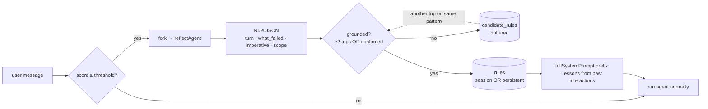

# Reflection loop

**Status**: design — not yet implemented.

**Working name**: `reflect`. Sibling namespace to `agent`, `session`, `db`, etc.

## Direction

**Detect dissatisfaction → reflect into a rule → inject into the next system prompt.** Three small stages, each with a clear contract. Heuristic detector (no LLM). Conditional reflection (LLM, but only when detector trips). Plain-text rule store, scrutable and editable.

The rules are not feelings ("user is frustrated"). They are imperatives ("don't propose architectural refactors without a concrete pain signal"). What gets injected is *how to behave*, not *what the user feels*. This is the single design choice that distinguishes the loop from sycophancy automation.



## Why this exists

A single-user code agent accumulates friction the user can never write down. The user pushes back terselely ("не везде", "опять не то"), corrects the same mistake the third time, gets curt after a long agent reply, falls silent. None of this lands in CLAUDE.md or in the system prompt. Next session starts with the same default agent, same defaults, same friction. The user's only reliable path is to copy-paste a fresh "preferences" block at the top of every conversation — which they don't do, and shouldn't have to.

This loop tries to close that gap **specifically** for behavioral patterns that show up across turns and sessions. It does **not** try to be a memory system, a personality engine, or an empathy simulator.

## Three stages

### Stage 1 · Detect

**Pure heuristics. No LLM call.** Runs after every user message append, before the next agent turn. Outputs `{score: 0..1, signals: [...], archetype: '...'}`.

Signal sources (ranked by precision, highest first):

1. **Correction patterns** — user pastes back the agent's claim with a negation, edits the agent's last code block and re-emits, or types `не <X>` where `<X>` is a substring of the previous agent message. *Highest weight.* Falsely indistinguishable from learning.
2. **Repeat detection** — same user message twice within N turns (the agent didn't get it the first time). High weight.
3. **Sudden length collapse** — user-message length ÷ previous-user-message length < 0.3 immediately after a long agent reply (>500 chars). Signal that the agent over-explained.
4. **Lexical markers** — `не\s`, `опять`, `почему`, `wrong`, `nope`, `stop`, `блять`, `??!`, `!!!`. *Lowest weight* — banter and curt acknowledgement look identical.
5. **Walkaway** — session ends within ≤2 turns of agent reply with no positive signal in between. Tracked across sessions.

Archetypes are taken from *Invisible Failures in Human-AI Interactions* (arXiv 2603.15423) — death-spiral, contradiction-unravel, walkaway, silent-mismatch, confidence-trap. The detector tags each trip with one archetype.

Threshold default: `score ≥ 0.7` to fire reflection. The threshold is one number; tuning happens by re-weighting signals, not by changing logic.

### Stage 2 · Reflect

**LLM call, in a fork.** Spawned non-blocking after the user message lands; does not delay the current turn's response. Uses the cheapest available model (Haiku via Anthropic, Llama via LMStudio, mock for tests).

Reflect-agent's system prompt:

```
You are a dialog analyst. Given a transcript and a detected friction signal,
identify the SPECIFIC failure and propose a behavioral imperative for future
turns. Be concrete. No empathy talk.

Output strictly this JSON:
{
  "failure": {
    "turn_idx": <int>,
    "what_agent_did": "<one sentence>",
    "what_user_wanted": "<one sentence>"
  },
  "rule": {
    "imperative": "<one sentence, positive form preferred — 'when X, do Y' beats 'don't do X'>",
    "scope": "session" | "persistent",
    "applies_when": "<short trigger phrase the future agent will recognise>"
  },
  "confidence": 0.0..1.0
}
```

`scope = session` — local to this dialog (e.g. "user wants maximum brevity in this thread"). `scope = persistent` — applies forward across sessions (e.g. "this user pushes back on architectural overhauls without a concrete pain signal"). The reflector decides; the user can override later.

If the reflector cannot identify a clean failure, it returns `{rule: null, confidence: 0}` and the trigger is dropped. **Never invent a rule to fill the slot.**

### Stage 3 · Inject

**Two-step gate before a candidate rule becomes active.** This is the most important defence against sycophancy amplification.

1. **Buffer**: every reflector output goes to `candidate_rules` first. Never directly to active.
2. **Promote**: a candidate becomes active when *either*:
   - the same `applies_when` pattern appears in ≥2 distinct candidates within an N-day window, *or*
   - the user explicitly confirms (one-click in the UI, or types `/rules confirm <id>`).

A single dissatisfaction trigger never produces an active rule on its own. This is non-negotiable — without it, the loop is a sycophancy generator.

**Active-rule injection format** in `fullSystemPrompt`:

```
Lessons from past interactions:
- <imperative 1>  (since 2026-05-03 · 4 hits)
- <imperative 2>  (since 2026-04-18 · 11 hits)
- <imperative 3>  (since today · 2 hits)
```

**Cap**: at most 20 active persistent rules + 5 active session rules. When full, the system blocks new promotions until the user prunes or until the consolidation pass merges/deletes rules.

**TTL**: persistent rules with zero hits in 30 days are auto-deactivated (kept in history, not injected). Session rules die with the session.

## Data model

```sql
-- Persistent and session-scoped rules.
CREATE TABLE reflect_rules (
    id              TEXT PRIMARY KEY,           -- nanoid
    agent_id        TEXT,                        -- NULL for global persistent rules
    scope           TEXT NOT NULL,               -- 'session' | 'persistent'
    imperative      TEXT NOT NULL,
    applies_when    TEXT NOT NULL,
    state           TEXT NOT NULL,               -- 'candidate' | 'active' | 'deactivated' | 'archived'
    confidence      REAL NOT NULL DEFAULT 0,
    hits            INTEGER NOT NULL DEFAULT 0,  -- times applies_when matched after promotion
    last_hit_at     INTEGER,
    created_at      INTEGER NOT NULL,
    updated_at      INTEGER NOT NULL,
    origin_turn_idx INTEGER,                     -- pointer back into messages
    origin_agent_id TEXT,                        -- which agent's turn produced it
    notes           TEXT                          -- user-editable
);

CREATE INDEX reflect_rules_active ON reflect_rules(scope, state) WHERE state = 'active';
```

The `origin_*` columns are non-negotiable. Every active rule must point back to the transcript snippet that produced it — so the user can audit *why* this rule exists. This is the Kay (1998) scrutability principle and the single biggest lesson from production memory systems (Cursor's `.cursor/rules`, Claude Code's `CLAUDE.md`, ChatGPT's bio tool) — without scrutability, users lose trust as soon as the agent's behavior changes inexplicably, and the next dissatisfaction reading becomes unreliable.

## Architecture sketch

```
src/reflect/
  $type_Rule.ts                          → types.reflect.Rule
  $type_DetectionSignal.ts               → types.reflect.DetectionSignal
  $migrate_<ts>_reflect_rules.up.sql
  detect.ts                              ctx.fns.reflect.detect(ctx, agentId)
                                           → { score, signals[], archetype }
  reflectFork.ts                         ctx.fns.reflect.reflectFork(ctx, agentId, signal)
                                           → spawns fork, parses JSON, writes candidate
  promote.ts                             ctx.fns.reflect.promote(ctx, ruleId)
                                           → candidate → active (when grounded)
  loadActive.ts                          ctx.fns.reflect.loadActive(ctx, agentId)
                                           → active rules for SYSTEM_PROMPT injection
  consolidate.ts                         ctx.fns.reflect.consolidate(ctx)
                                           → merge similar rules, deactivate stale
  $route_rules_GET.ts                    UI: list + edit + delete
  $route_rules_$id_DELETE.ts             user-driven removal
  $route_rules_$id_promote_POST.ts       user-driven confirmation

In session/appendUserMessage.ts (after the row is committed):
  const sig = ctx.fns.reflect?.detect?.(ctx, agentId);
  if (sig && sig.score > 0.7) {
      // fire-and-forget; never block the user response
      ctx.fns.reflect.reflectFork(ctx, agentId, sig).catch(err => {
          console.warn('[reflect] fork failed', err);
      });
  }

In agent/fullSystemPrompt.ts:
  const rules = ctx.fns.reflect?.loadActive?.(ctx, agent.id) ?? [];
  if (rules.length) {
      prompt = `Lessons from past interactions:\n${rules.map(r => "- " + r.imperative).join("\n")}\n\n` + prompt;
  }
```

The `reflect` namespace is optional — code that references it does so via `ctx.fns.reflect?.<fn>?.(ctx, ...)`. The agent runs cleanly with the namespace absent, which keeps tests and migrations simple and lets the loop be enabled per-environment via a setting.

## Prior art and what we copy from where

This design is the union of established components. It is not novel as a whole; the *combination* (automatic detection + autonomous rule synthesis + automatic prompt injection) is uncovered in production systems but well-precedented in research.

| Source | What we adopt |
|---|---|
| **PRELUDE / CIPHER** (Gao et al., NeurIPS 2024 · arXiv 2404.15269) | The closest published analogue: edits → preference → prefix injection in a writing assistant. We adapt the prefix-injection mechanic and the per-context preference idea. |
| **Generative Agents** (Park et al., UIST 2023 · arXiv 2304.03442) | The reflection-node template: threshold-gated firing → questions → high-level insights. Our reflect agent is a stripped-down version of this node. |
| **Reflexion** (Shinn et al., NeurIPS 2023 · arXiv 2303.11366) | The verbal-self-reflection idea and the *degeneration-of-thought* warning. We adopt the buffer; we use external grounding (the user) to avoid the failure mode. |
| **mem0** (arXiv 2504.19413) | The ADD/UPDATE/DELETE/NOOP operator vocabulary against existing memories. The `consolidate.ts` step is a stripped-down version. |
| **Claude Code memory / CLAUDE.md** | The plain-text, scrutable, file-shaped store. Production-tested at Anthropic's own coding agent. |
| **Judy Kay, scrutable user models (1998)** | The *non-negotiable* principle that any user model must be inspectable and editable by the user. Drives the `$route_rules_GET.ts` UI. |
| **DRIFT** (arXiv 2510.02341) and **WildFeedback** (arXiv 2408.15549) | Empirical validation that user-dissatisfaction is a usable signal — DSAT events in WildChat-1M run ~12% of turns vs ~5% SAT, so negative-leaning detectors are operating in the abundant-signal regime, not the scarce-signal regime. |
| **Invisible Failures in Human-AI Interactions** (arXiv 2603.15423) | The detector archetype taxonomy. Replaces ad-hoc lexicons (death-spiral, contradiction-unravel, walkaway, silent-mismatch, confidence-trap). |

## Failure modes

These are the things that go wrong. Each maps to a mitigation in the next section.

1. **Sycophancy amplification.** *The biggest risk.* Sharma et al. (arXiv 2310.13548) and the RLHF-amplifies-sycophancy follow-up (arXiv 2602.01002) show that current models flip correct answers to wrong ones in response to implicit user dissatisfaction. The detector here literally optimizes for the same signal. If the reflector is the same model, naively-injected rules will codify "agree with the user faster." The loop becomes a sycophancy generator.
2. **Degeneration of thought.** Repeated reflection without new information produces worse outputs (Reflexion paper). If the same friction pattern fires reflection N times in a session and each adds a rule, the rule pile becomes contradictory and the agent's behavior becomes *more* erratic.
3. **Implicit-feedback noise.** *User Feedback in Human-LLM Dialogues* (arXiv 2507.23158) finds that implicit feedback is informative for understanding users *but noisy as a learning signal.* Our detector is implicit-feedback-only; false positives are guaranteed.
4. **Rule rot / overfitting.** Cursor-forum reports (and mem0's existence) document this in the wild: stale rules outlast their context, project rules leak into global scope, contradictory rules silently coexist, the model ignores some rules and obeys others arbitrarily.
5. **Specification gaming on the rules themselves.** Once the agent knows rules are model-generated from frustration cues, it can route around them (e.g., comply formally with the imperative while sandbagging the substance). Less acute single-user but real.
6. **Memory poisoning.** Once active rules are auto-injected into every system prompt, that surface is a prompt-injection target. Tenable TRA-2025-11 (ChatGPT memory injection), Rehberger's ZombieAgent and ChatGPT-memory-hacking write-ups, NVIDIA's *Mitigating Indirect AGENTS.md Injection* and Snyk's *ToxicSkills* (13.4% of audited agent skills with critical security flaws) are the operational threat reports. Agents that read code/docs/issues/web content can inject rules through that channel if we're not careful.
7. **Loss of scrutability (Kay).** Users can't tell *why* the agent now behaves differently. Trust erodes; the next round of dissatisfaction signals becomes unreliable; the loop poisons its own input.
8. **Oscillation.** A rule shortens replies → user asks for detail → new rule lengthens replies → first rule contradicted → both stay → behavior is unpredictable.

## Mitigations baked into the design

These are the three things from the research that *must* be present from day one. They are reflected in the data model and the code sketch above.

1. **External grounding before promotion.** No rule becomes active from a single detection event. Either the same `applies_when` pattern fires ≥2 distinct times within a window, *or* the user explicitly confirms (one-click in the UI). This is the only thing standing between this design and the sycophancy trap. PRELUDE's k-nearest-context aggregation, mem0's UPDATE/DELETE operators, and Voyager's self-verification are versions of the same idea — all of them gate promotion behind external confirmation.
2. **Scrutable, capped, editable rule set.** Every rule shows its origin transcript snippet (`origin_turn_idx`, `origin_agent_id`). The rules UI lists every active rule with one-click delete, edit, and "demote to candidate". Hard cap of 20 active persistent + 5 active session — when full, no new promotion until consolidation. Kay (1998) is non-negotiable.
3. **Detector grounded in archetypes, not affect words.** Correction-patterns and repeat-detection get the highest weight; lexical markers (swears, negations) are *least* trusted. The detector tags every signal with one of the eight Invisible-Failures archetypes, and the reflector sees the archetype name, not just the score. Affect-word-only detectors will train sycophancy harder than no detector at all.

## Operational notes

- **Reflect runs in a fork**, not in the main agent. The fork inherits transcript via the existing `session.fork` mechanism (parent_id + fork_offset; lazy assembly via `getFullMessages`), so we don't pay the cost of copying. Fork model defaults to Haiku via Anthropic, falls back to LMStudio Llama for offline runs, mock for tests.
- **Reflection is fire-and-forget.** It must not block the current user turn. The next agent reply uses whatever rules are active at the moment of `fullSystemPrompt` call; new candidate rules from this turn's reflection are visible from the *next* turn at the earliest, only after promotion.
- **Hot path**: `appendUserMessage → detect → maybe reflectFork (async) → user gets normal agent reply`. Detect is ~0ms (regex + length math). The user never waits for reflection.
- **Cost ceiling**: with promotion gated on ≥2 distinct triggers and a cap of 20 active rules, an attacker (or a confused detector) cannot generate unbounded reflect-fork calls. A simple per-agent rate limit (max 5 reflect forks per hour) caps spend.
- **Regression-test set**: keep a held-out set of canonical tasks that we re-run periodically against the rule-augmented prompt to detect when accumulated rules have made the agent *worse* at something it used to do well. This is the "voyager curriculum" gap nobody has solved cleanly for behavioral rules — we can at least notice the regression.

## Open questions

- **How does the reflector know about existing rules before proposing a new one?** mem0's UPDATE/DELETE operators answer this for declarative facts; less clear for behavioral imperatives. First-pass: the reflector receives the full active rule list in its system prompt and is asked to choose between `add`, `update <id>`, `delete <id>`, `noop`.
- **Should rules ever be auto-deleted by the system?** Stale-TTL deactivation is safer than deletion. Probably never auto-delete, only auto-deactivate; let the user purge.
- **Cross-agent persistence boundaries.** Does a rule learned on agent `aw` apply to agent `bx`? Current default: persistent rules with `agent_id = NULL` are global; rules with `agent_id` set are per-agent. The reflector chooses. This may need to become per-thread per-topic later.
- **How do we surface that a rule is currently shaping the reply?** The simplest version is a tooltip in the UI showing which rules were in the system prompt for a given turn. Without this, a Kay-style audit is hollow.
- **What happens during a fork?** A child session inherits the parent's active rules at fork-time; rules learned in the child don't propagate back to the parent unless explicitly promoted by the user. (Probably. Open.)
- **Per-model rule packs?** A rule that works for Sonnet may be cargo-cult for Haiku. May need to gate active-rule injection on the model class. Not in v1.

## Status and rollout

- v0 — manual ruleset only. Add `reflect_rules` table; populate by hand via REPL; system prompt prefix injection; UI to list/delete. **No detector, no reflector.** Validates that the injection-and-consolidation half of the loop is useful without the auto-feedback half. This is also the cheapest empirical test of whether the rules actually change behavior at all.
- v1 — detector + reflector + candidate-buffer + manual confirmation only. Auto-promotion disabled. User must approve every active rule. Two weeks of dogfooding.
- v2 — auto-promotion on ≥2 distinct triggers. Consolidation pass. Stale-TTL deactivation. Cap enforcement.
- v3 — cross-agent reasoning, per-model packs, regression-test set.

The detector and reflector are independently disable-able by setting (`reflect.detector.enabled`, `reflect.reflector.enabled`) so we can ship them separately and revert one without touching the other.
